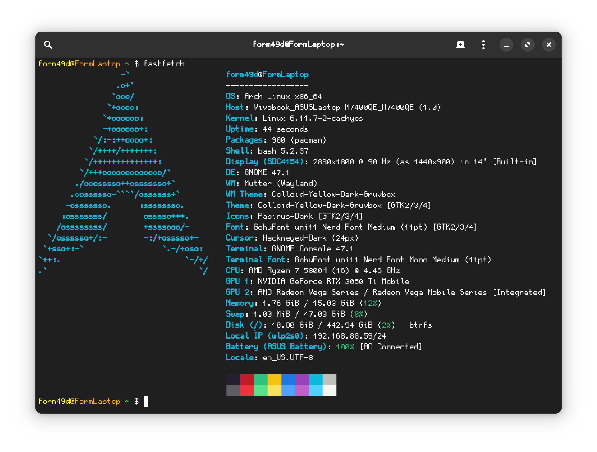

# My setup:

## Main PC:

### Specs:
- CPU: **Intel Core i7 10700K**
- RAM: **G.Skill Trident Z RGB 3000C14 16Gbx2**
- Motherboard: **MSI Z490 Unify**
- GPU: **MSI Nvidia GeForce RTX 3070Ti Ventus OC**
- SSD's:
    1. M2_1: **Samsung 970 Pro 512Gb**
    2. M2_2: **Gigabyte gp-gsm2ne3100tntd 1024Gb**
    3. SATA1: **Samsung 860 Pro 512Gb**
- CPU Cooler: **Noctua NH-D15**
- PSU: **Seasonic Prime Ultra Gold 1000w**
- Fan's: 
    1. FRONT(UP): **be quiet 140**
    2. FRONT(DOWN): **be quiet 140**
    3. MEMORY: **be quiet 140**
    4. BACK: **nzxt 120**
- Case: **NZXT H510**
- Main OS: **Windows 10 Enterprise LTSC IOT 2021**
- Testing and Overclocking OS: **Windows 10 Pro v20H2 (Tweaked *[ReviOS](https://www.revi.cc)*)**

OC Setup:

### Peripheria:
- Mouse: **Logitech G502 Hero SE**
- Keyboard: **Varmilo VEA87 Yakumo**
- Speakers: **B&W A7**
- Microphone: **AKG Lyra**
- Headphones: **B&W PX-7**
- Monitor's:
    1. Right: **MSI Optix G273QF**
    2. Left: **Samsung Odysey G27**

## Second PC:

### Specs:
- CPU: **Intel Core i5 10600K**
- RAM: **G.Skill Trident Z RGB 3200C14 8Gbx2**
- Motherboard: **Asus ROG STRIX Z490-I Gaming**
- GPU: **Asus TUF RTX3060Ti O8G V2 Gaming LHR**
- SSD's:
    1. M2_1: **Samsung 970 Evo Plus 500Gb**
- CPU Cooler: **Noctua NH-U12S Redux**
- PSU: **Super Flower LEADEX III SUPER BRONZE PRO 850W SF-850R14HE**
- Fan's:
    1. FRONT(UP): **Fractal Design Aspect 12 RGB PWM**
    2. FRONT(DOWN): **Fractal Design Aspect 12 RGB PWM**
    3. BACK: **Fractal Design Aspect 12 RGB PWM**
- Case: **Fractal Design Pop Mini Air**
- Main OS: **Windows 10 Enterprise LTSC IOT 2021**

### Peripheria:
- Mouse: **Logitech G502 Hero**
- Keyboard: **Logitech G Pro**
- Speakers: **B&W A7** (Currently broken)
- Monitor: **Asus TUF Gaming VG27AQ1A**

## Main Laptop:
- Model: **ASUS Vivobook Pro 14X OLED M7400QE-KM117**
- Main OS: **Arch GNU/Linux**
- Mouse: **Mad Catz R.A.T. 8+ ADV**

**Fetch**:

(dGPU turned off)

## Phones:
- Main: **Google Pixel 7** White, 128gb, (US) (With [GrapheneOS](https://grapheneos.org/) installed)
- Music player: **Apple iPhone 7** Black, 256gb, (Certified Refurbished) (With iOS 13 installed)

## Other:
- Tablet: **Apple iPad Pro 10.5** 2018, 256gb, with Apple Pencil(1'st gen)
- Routers:
    1. **Mikrotik Hap AC2** x2
    2. **TP-Link Archer AX73 AX5400**
- Printer: **Brother DCP-T225**
- VR: **Meta Oculus Quest 2 512gb**
- Old Laptop: **Apple Macbook Pro 15** A1990, 2019, US, (Certified Refurbished), (i7 - 2.6ghz)
